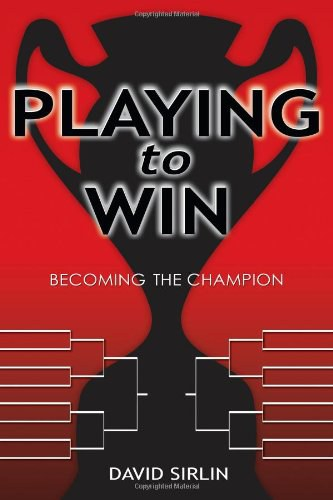
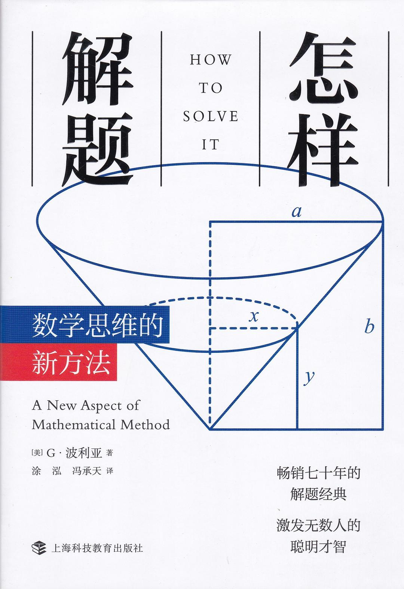
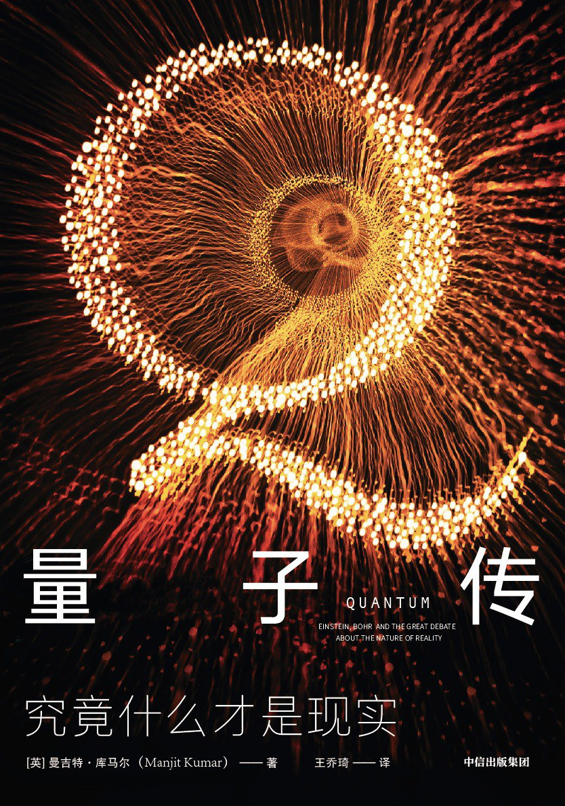
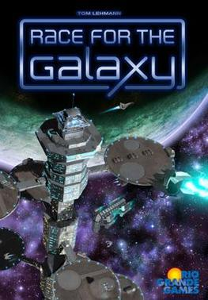

# 生活

Terence一岁半了，他不再是去年那个躺在摇篮里面、大部分时间都在睡觉的小娃了。今年他能跑，能吱吱呀呀大叫一气，模仿着说一些简单的词(Apple，morning)，还表现出了越来越明显的个人主见。他会拉起我的手，去他想玩的玩具前面，让我陪他玩。如果大人走开的话，他会一下大哭起来。也许将来有一天，他会更喜欢自己一个人玩吧。

有时候我觉得他是近十年里发生在我身上最好的事情，有时候我只想找个清静的地方好好地静一静。

和Hui去了一次激流岛。路过顾城故居，那里已经是湮没在萋萋荒草中的一栋危房。又去了一片无人的沙滩，看着海不说话，晒着太阳，那片刻是今年最平静的瞬间。

开始恢复锻炼了，跑步+俯卧撑。

# 教育

开始和Hui做Youtube的长视频/Shorts的尝试，看将来是否有机会转化到Udemy线上课程。

# 投资

相比起去年初的大风大浪，今年市场的主角是“易中天”为首的科创板块，但同时也是微盘股的牛市，截止到12-28，微盘股指数年内涨幅81.57%，我的账户跟着有了一些收获，挣到了一些beta的钱，同时也做了一些记录，反思为什么我们的想法往往都是错的。

今年大概最值得记录的日子是4月7号，关税战的消息出来，市场无差别地崩溃了，千股跌停，我第一次体验到了手上持仓-20%跌停。当时我提前根据均线信号做了一些减仓，我也从去年初的惨痛教训中学到了不要在这种猛跌中减仓，但问题在于，要不要抄底？我选择了不动。事后看来，那是一个黄金加仓点，**但我现在仍然认为，我不加仓也是正确的。** 在所有或然历史中，我都不想经历所有可能会对账户造成毁灭性影响的事件。

要么早跑，要么不跑。

2026年如果微盘崩了怎么办？空仓出来放到货基，或者挪一些去转债上。

在AI的帮助下看了一些美股ETF标的，明年买一点试试水。

# 阅读

最近明显的变化是很难静下心看点书了，翻开一两页就不自觉地开始玩手机，所以很多书都只看了个开头。另外一方面，对于小说也越来越不感兴趣了，今年读的几本有意思的书记在这里。

1. Playing to win

作者曾在MIT读书时，代表美国队参加街霸的世界比赛，后来投身游戏行业。这本书糅合了他对于街霸、国际象棋、孙子兵法的种种心得，印象比较深的一点是他提到街霸水平比较菜的玩家反而有种奇怪的道德洁癖：那些人会认为某些招式使用门槛较低，又很无趣，让对手和自己都很难受，属于“赖招”，因此自己不用，也看不起那些使用“赖招”的人。而职业选手则是非常实用主义的态度，他自己就在一场非常重要的比赛中用“赖招”取得了胜利。看到这里就会让人想到某些“中巴”（巴菲特中国分巴）对其它投资路数的鄙视。

2. 怎样解题

在给学生上课时，一个难题是怎样把新的重要的概念灌输给他们。

波利亚的建议是建立Analogy，把新的概念类比到他们熟悉的概念上去，把长方体对角线类比到长方形的对角线上去。

老师应该退到后面，让学生来做解题的主角。对于一道题目，老师应当一直问几个普适而重要的问题：题目在问什么？什么是已知的？限制条件是什么？你能否想到一些已经学过的类似的题目？学习就是不断地在新知和旧知之间搭起桥梁的过程。

3. 量子传

面对完全陌生、难以解释的现实时，应该怎么办？人的第一反应往往是为新现象增加修正项，以便能用旧有的、符合直觉的经典理论去框，然而这样并不总是奏效，宇宙并非是按照人的直觉来设计的。书中让我印象比较深的，是海森堡独自一人去岛上那段：他下定决心，从实验的结果开始来思考，其它的一切都摈弃掉了，不管那些理论有多么权威，都不允许进入新的框架。就这样，他终于从一片空白中建立起来了与实验结果完美相符的新的理论框架。

这种完全从最基础开始，自己动手钻研的精神，在物理学家中似乎颇为常见，另外有一个费米带李政道，花一周时间自己动手制作计算尺，验算太阳核心温度的故事。[^1]

我们并非物理学家，需要日常钻研量子理论，但是这种思维模式是非常重要的。比如像投资，对于这种复杂的课题，没有什么比对某种理论（无论被认为多么神圣权威）不加思索地全盘接受，而不加以自己的思考批判危害更大了。

像海森堡一样思考。

# 桌游

银河竞逐（Race for the galaxy）：这是一个讲究tempo和概率的游戏，所有的手牌都互为机会成本，大部分时间手上拿到的牌都很平庸，东一张西一张，怎样把这一般的牌打出还可以的效果，效益最大化？一局20分钟不到，却要做大量的选择，特别是在前中期要做许多取舍，是很好的思维锻炼。

# 其它

AI这两年的进展真的太快了，去年的时候还做不了什么，今年已经变成了比较好用的工具，今年用AI帮助做了：
- 题库框架 
- Final Test自动评分+邮件反馈，未来的新生自测也可以使用这套系统
- 课程表编辑器
- 投资方面：美股ETF投资组合评估回测、可转债动态仓位评估调整
- 银河竞逐的思路

总体来说，ChatGPT像文科生，会一直揣测我的提问意图并给我心灵massage；Gemini像理科生进行各种分析；Claude则是程序员，一言不合就开写代码来解决问题。

# 新一年的计划

1. 带Terence多转转

2. 在本地把数据系统建立起来，测试一些新的策略

3. 开始试着买一些美股ETF

4. 学会方舟动物园

5. 继续锻炼

6. 多多花钱买时间

[^1]: 见[这位“神童博士”，31岁站在诺贝尔奖领奖台](https://news.bjd.com.cn/2025/11/24/11423786.shtml)
